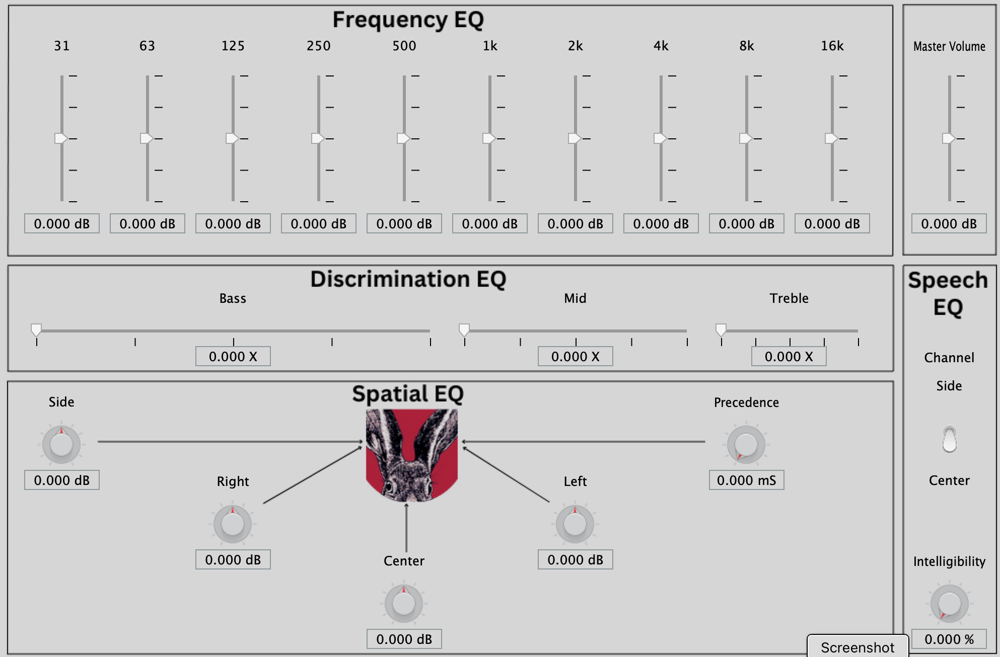

# accessEQ

## PURPOSE
 A self contained Matlab project that generates a macOS AUv3 audio enhancement app. As an AUv3 app, it consists of 2 components. 
 
 The first component is what Apple calls the "Container App". When run this way, it uses the Mac's microphone as an audio source. It acts like a simple hearing aid, running the microphone signal real-time through the effects. As a result, it can also be used in technical applications, as a means for capturing sounds to faint for normal hearing. 
 ### NOTE 1: 
    To prevent an audio feedback loop from forming, headphones must be worn whenever actively using the container app. Ear buds with a tight seal are ideal.
  
 The second component is the AUv3 audio plugin. It's intended to be used with a 3rd party system-wide audio capture host application. The plugin together with such a host app, allows a user to enhance the quality of _all_ audio coming from the Mac. I have tested it successfully with [SoundSource](https://rogueamoeba.com/soundsource/) and [eqMAC](https://eqmac.app/). It can also be run in DAWs as a mastering type effect. I have tested it successfully with [Audacity](https://www.audacityteam.org/) and [Garage band](https://www.apple.com/mac/garageband/) DAWs.
### NOTE 2:
    The container app registers the AUv3 plugin with macOS the first time it's run. Therefore, for the 3rd party apps to be able to find the accessEQ plugin component, the accessEQ container app MUST be run once.    

## APP DOWNLOAD INSTRUCTIONS
The built app file is available to download for free right here on Github. It has been successfully back tested to macOS version 11.7.10. To download: 
1. On the far right of the github landing page, under Releases, click on **Initial Release**
2. On the next screen, under Assets, click on **accessEQ.app.zip** to download the app as a zip file.
3. Allow the download to complete.
4. Unzip **accessEQ.app.zip** to **accessEQ.app**
5. Move **accessEQ.app** over to the Mac's regular Application folder.
6. Click on **accessEQ.app** to run it.

## DEVELOPER INSTRUCTIONS

### MATLAB Build Requirements
- Matlab Release 2024A or later
- Audio Toolbox
- DSP System Toolbox

### MATLAB Build Instructions
- Run "generateAudioPlugin -auv3 accessEQ" from within the Matlab console window.
- Additionally helpful Matlab commands are shown at the very top of the accessEQ.m file.
- Use the included accessEQ icon in all derivative projects to help spread the brand.

## EFFECTS DESCRIPTION

### Frequency EQ

This is generic EQ with the caveat that it uses high quality "brick wall" filters. Each filter covers a single octave, the complete set covers the entire spectrum of human hearing. To hear the quality of the filters, turn all bands down except 1. Then slowly move the active band from one octave to the next. Clearly distinct signals should be heard. This contrasts with most EQ implementations which use "shelving" filters.

### Discrimination EQ

This is feature is based on "shaping" filters. They apply the Fletcher-Munson equalization curves. By doing so, signal components that are close in frequency are more easily "heard out". 

### Spatial EQ

This features provides the ability to selectively highlight different locations of the sound field. This can be useful to hear out a particular signal that's being masked by another signal in a different portion of the field. A simple example could be a speech signal that's coming from the side that's being masked by a noise signal coming from the center.

### Speech EQ

This feature is designed to highlight speech content in the presence of non-speech content. For example, when listening to music, the vocals are highlighted.

### Loudness EQ (Master Volume)

This simple control is included to facilitate normalizing volume. After all the effects are applied to taste, a round of simple wet/dry testing, while adjusting the master volume, allows the wet loudness to match the dry loudness.

## FUTURE IMPROVEMENTS

 Generally, Matlab comes out with bi-annual updates that are indicated by the year and an A or B extension. For example, 2024A indicates the first release of 2024. These releases usually include new audio features. 
 
 My updates will track with Matlab updates and use the same release versioning scheme. See "Introduction to accessEQ" for a detailed Roadmap.

